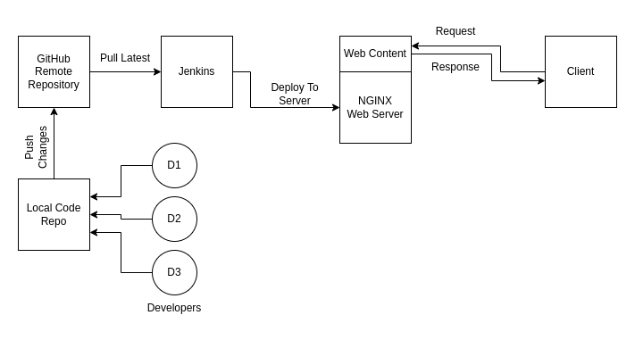

# A Simple CI/CD Pipeline hosted in Local System

## Tools Used

* Nginx: Web Server
* Jenkin: CI/CD Automation Tool
* Git + GitHub: Version Control + Source Code Repo
* Ngrok: Expose Locally Hosted Jenkins over Internat - Used for GitHub WebHook

## Description

A simple static web content is hosted on Nginx Server locally everytime time changes are pushed on to the remotely hosted github repository jenkins job will be triggered and changes will be pushed on to Nginx Server.

## Installations

* Nginx: https://www.nginx.com/resources/wiki/start/topics/tutorials/install/
* Jenkin: https://www.jenkins.io/doc/book/installing/linux/
* Git: https://git-scm.com/book/en/v2/Getting-Started-Installing-Git
* Ngrok: https://ngrok.com/download [Please create account first to get auth token]
* GitHub: Create an account on GitHub

## Steps

### Git and GitHub

Create a new repository and commit a file with name "index.html" with random html content. We will be pushing the same file on to the nginx server which will be served by nginx.

### Jenkins

For jenkins to be able to reload nginx we need to add Jenkins user to sudoers list.
Inside the file /etc/sudoers type the following
* jenkins ALL=(ALL) NOPASSWD: ALL

Create a new free style project and do the following
* Enable "GitHub hook trigger for GITScm polling" under Build Triggers
* Configure git repository correct branch under Source Code Management
* Under Additional Behaviours provide a "Local subdirectory for repo" path where jenkins will pull latest code
* Run the following commands in "Execute Shell" under Build Steps
  * cp {subdirectory repo path}index.html {default nginx configuration path for index.html}html
  * sudo nginx -s reload

### Ngrok

Ngrok helps us too expose our locally hosted jenkins application over Internet which will further help in creating webhooks inside GitHub repository.
Under GitHub Repository setting provide the url created by ngrok inside webhook 
* Url: {url by ngrok}/github-webhook/

Try pushing changes to the index.html file under GitHub repository following will happen:
* GitHub webhook will trigger Jenkins Job
* Jenkins will pull latest code from GitHub
* Jenkins will replace the index.html with default nginx index.html file
* Jenkins will reload the nginx server
